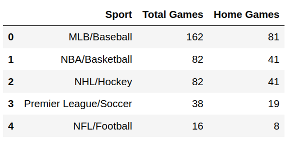
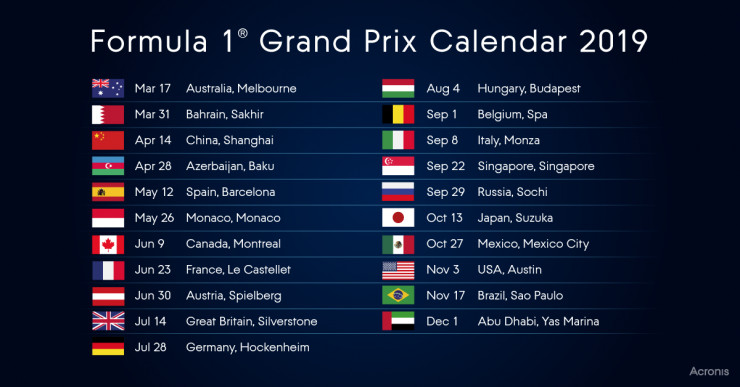
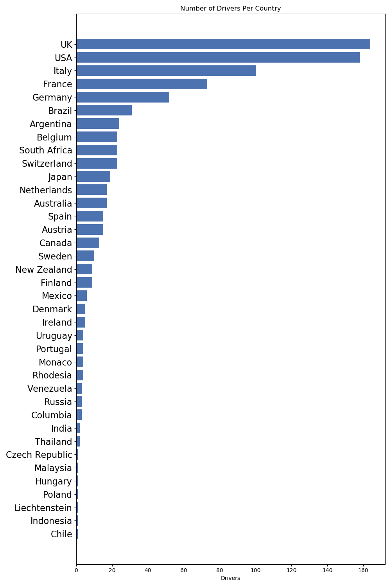
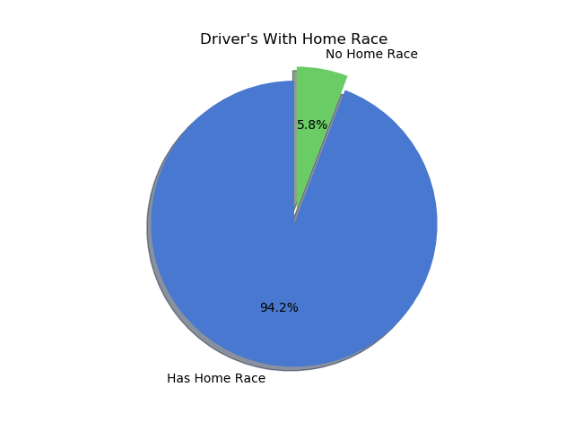
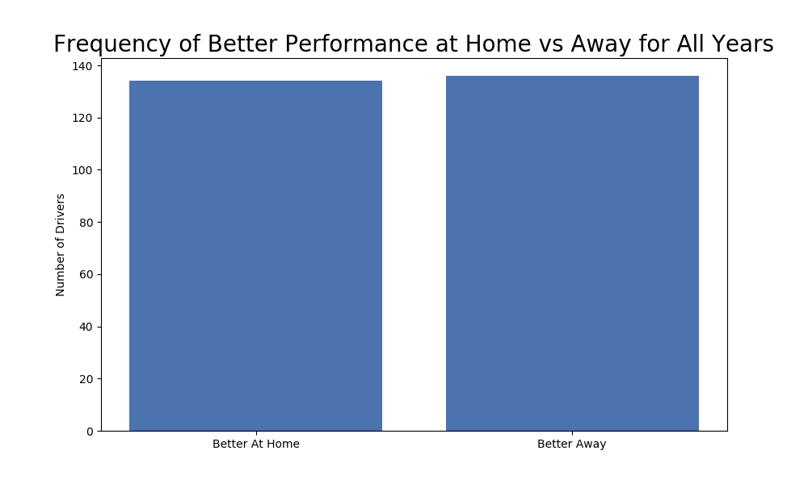
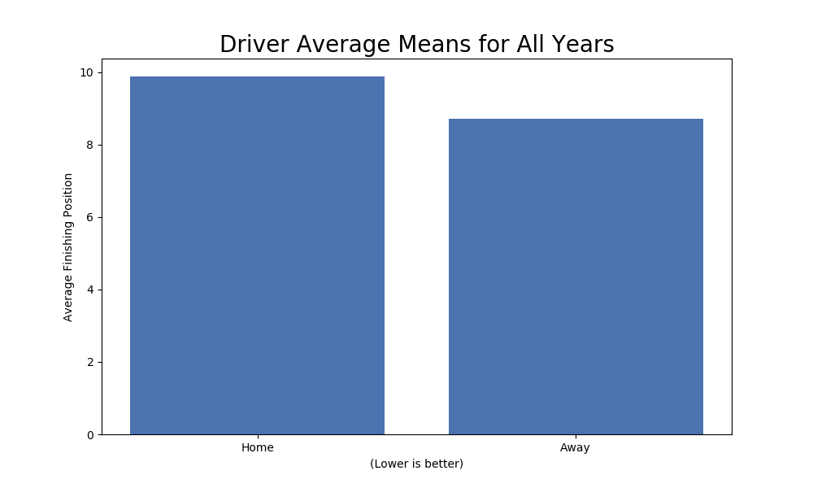
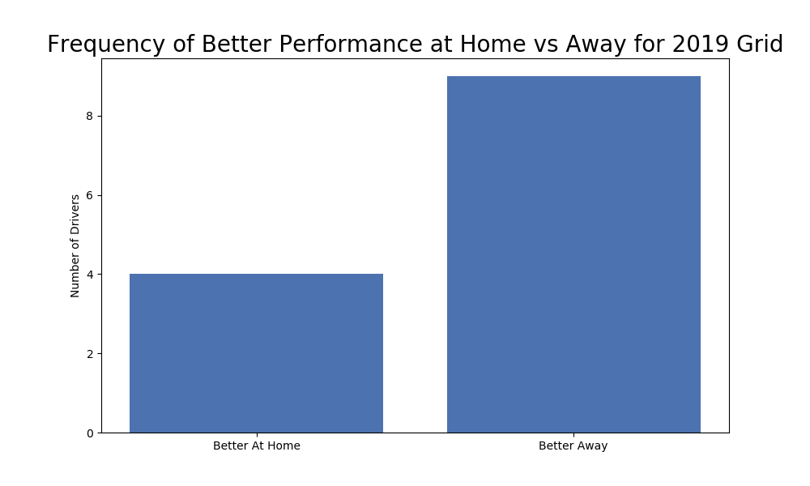
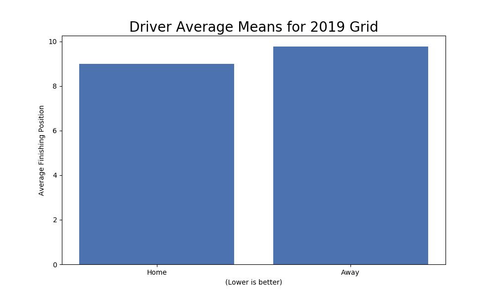
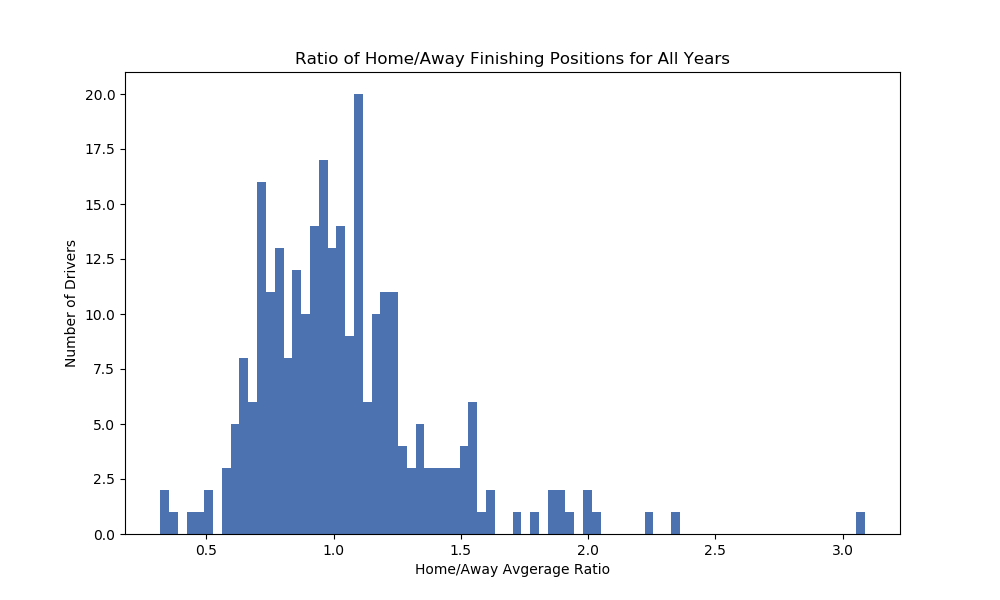

# Do F1 Drivers Benefit from a Home Field Advantage?

What does it take to win? While there are many factors, it would be tough to argue with the benefits of practice and repetition. These are key factors at the heart of "the home field advantage". The more an individual or team practices and competes on their home turf, the more they learn about the nuances and subtleties of their field and how to take advantage of these qualities. 

Furthermore, as athletes practice and compete over and over again in the same place their minds are unconsciously boosting performance at home due to the psychological phenomena of state dependent learning in which states that performance on a task is most effective when an individual is in the same situation, or state, as it  when the skills was learned. 

The confidence boost received from fan support during competition that can inspire and energize the athletes to better performance is another core element of the home field advantage. This project explores the question of whether the idea of a "home-field advantage" occurs in Formula 1 racing. Uses Python, Pandas, Numpy and MatPlotLib.

<table border="0" style="width:100%">
  
  <tr>
    <td></td>
    <td></td>
  </tr>
</table> 

Most major sports have ample opportunity to cultivate the home field advantage.

Formula 1 is a global phenomenon and one of the most popular sports in the world (we can debate whether auto-racing is a sport in another project...). It is unique in how a season of races spans the world unlike any other major sporting competition. The F1 calendar consists of 20 races in 20 different countries, leaving driver's little opportunity to spend time on any one track. **If they have a home circuit, the driver only gets 1 home race.** Additionally, there are strict regulations that govern how much time a driver can practice on a track as well as how much total time they are allowed to drive in the car.

So if core repetition and familiarity components of the home field advantage are stripped away, does it still benefit F1 drivers? Is the fan support enough to keep the advantage alive?

## The Data

### Source

The data was obtained from the Kaggle Dataset <a href='https://www.kaggle.com/rohanrao/formula-1-world-championship-1950-2020#constructor_results.csv'>Formula 1 World Championship (1950 - 2020)</a> and contains detailed information about every Formula 1 race since it's inaugural 1950 season up to the end of the 2019 season. During this time there were:

-  46 columns of data with a mixture of ints, floats, strings and dates
- 1040 Races
- 847 Drivers
- 24,600 Race results
- Relatively clean, though some handling of null values and conversion of column datatype was needed.

### Correlations

- Mild correlation between Number of Laps and Finishing Position: -0.656489
- Only a -0.57 correlation between Championship Points and Finishing Position - I would have expected a stronger correlation.

### Data Decisions and Definitions

#### valid

valid = driver finished the race

#### 'home field'

home = driver's designated home country matched the country the race circuit was in

## Hypothesis

Remember, **a lower finishing position is better**

​	Ho: Average Finishing Position at Home = Average Finishing Position Away

​	Ha: Average Finishing Position at Home < Average Finishing Position Away	

## Analysis and Results

### Drivers' Home Country

Driver's come from all over the world:

Most of the drivers were able to be included in the analysis:

### For All Drivers Across All Seasons

Home Advantage Results for Years 1950 to 2019 - 12,700 rows

**Variance** of the average finishing result at **home**  - 21.143
**Standard Deviation** of the average finishing result at **home** -  9.881
**Variance** of the average finishing result **away** - 11.118
**Standard Deviation** of the average finishing result **away** - 9.368

Looking at the count of drivers who, on average, did better at home or better away helps us understand the impact of the data's high variance. This doesn't reflect the magnitude of the difference between the two so we still don't know if there is a significant difference between the groups.

Looking at all drivers across all 1040 races in Formula 1 history, we see that average of the finishing position at a home race is worse at 9.88 as compared to away races which had an average of 9.368. Furthermore, greater variance and standard within the home results highlights it's likelihood of greater fluctuation.

#### t-test

And finally, when we compare the average home results with the average aways results we see that at an significance level of .05 there is not a significant difference between the two groups. If anything, the difference is going in the direction of an advantage at away races.

t-test (ind) for home and away means: 

- p=0.052

- t_score=1.942

  

### Current Grid 

These data reflect the performance of all races that the current grid participated in. For example, Lewis Hamilton started Formula 1 in 2007, therefore, all of his races from 2007 to 2019 were included. Of the 20 drivers who participated, 12 were eligible for the evaluation.

Home Advantage Results for Years 2001 to 2019 having 1,512 rows

**Variance** of the average finishing result at **home**  - 11.64
**Standard Deviation** of the average finishing result at **home** -  9.0
**Variance** of the average finishing result **away** - 9.94
**Standard Deviation** of the average finishing result **away** - 8.98

Here we see a staggering difference between the frequency of better finishes away. Again, the high variance shows itself here. This makes sense in light of there being so many more away races and therefore opportunities to place well.

Interestingly, the comparison of finishing position means is not as disparate, yet, the t-test still shows there is no significant difference at an alpha of .05.

#### t-test

t-test (ind) for home and away means for 2019 Grid: 

- p=0.987

- t_score=t_score=0.016

### Home/Away Ratio (HAR)

Comparison of the ratio of drivers' finishing position at 'home' vs their finishing position 'away' produces the Home/Away Ratio (home race finishing position average / away race finishing position average)

The HAR will be smaller than 1 if the average finishing position at home is better than the away average and larger than 1 if the away average is better

##### 		Average HAR: 1.042

## Conclusions

Overall, the data does not support rejecting the null hypothesis and we much conclude that there is no significant home field advantage in Formula 1. The high variance in each group stands out and highlights how chaotic racing can be, pointing toward the idea that there are many confounding variables for predicting performance such as mechanical problems and being crashed into by another competitor. Regardless, I hope the drivers are still appreciative of the fan support they get when racing at home!

## Study Limitations

Definition of "home" refers to an entire country! For small countries this might be accurate, for large countries might be a poor definition.

Valid results could include drivers who have only competed in 2 races (1 home and 1 away), which could skew the data.

There are far more 'away' than 'home races' (1:20 ratio)

## New Directions

Each week Formula One polls fans for their favorite drivers. It would be interesting to see if there is any relationship with the fan ratings and the HAR.

