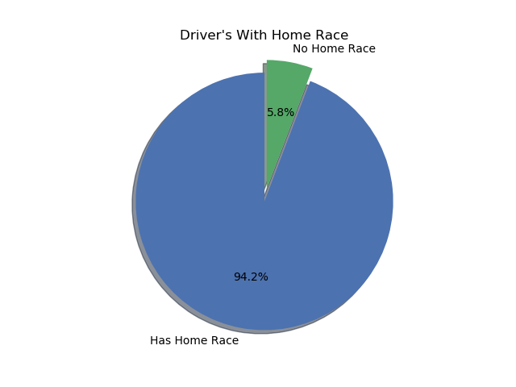

cd # Formula-One-Home-Advantage
This project explores the question of whether the idea of a "home-field advantage" occurs in Formula One racing. Uses Python, Pandas, Numpy and MatPlotLib.

<h1>The Data</h1>
Data decisions
only used races that the driver finished

Total drivers: 847
Drivers with home circuit: 798
without:

valid = driver finished the race

valid results with home circuit:
valid results without home circuit:

<h1>Analysis and Results</h1>
<h3>For All Drivers Across All Seasons</h3>
Formulate your two, mutually exclusive hypotheses.

a. Null, Alternate

\2. Choose a level of significance.

a. alpha

\3. Choose a statistical test and find the test statistic.

a. t or Z, usually

\4. Compute the probability of your results* assuming the null hypothesis is

True.

a. p-value

\5. Compare p and alpha to draw a conclusion:

a. p <= alpha, Reject Null in favor of Alternate

b. p > alpha, Fail to reject Null

Mean of home_means 10.0
Variance of home_means 21.0
Standard Deviation of home_means 10.0
Mean of away_means 9.0
Variance of away_means 11.0
Standard Deviation of away_means 9.0
t-test (ind) for home and away means: p=0.052, t_score=1.942

<h2>Study Limitations</h2>
Definition of "home" refers to an entire country! For small countries this might be accurate, for large countries might be a poor definition.